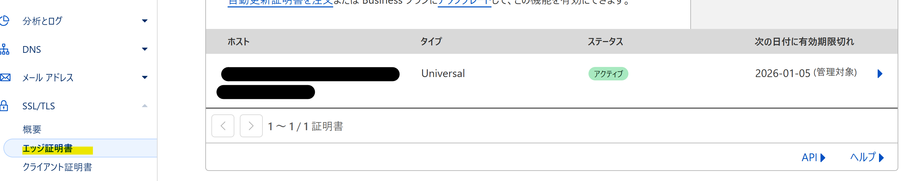
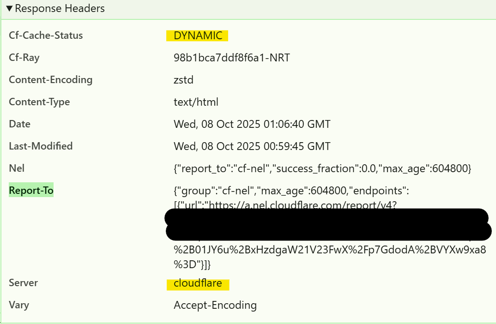

## 前提
- Cloudflareに権威ドメインがDNS登録済み
  - `example.com`のようにトップドメインの登録済みという意味
- DNSの検証が終わっている
- クレジットカード登録済み

## サブドメインの扱い
- Cloudflareはサブドメインを扱うことはできますが、ゾーン登録できません（Enterpriseプランが必要です）。
  - つまり、権威ドメイン以下すべてのサブドメインを1つのゾーンで管理することになります

## Cloudflareのゾーン
- `example.com`のドメイン配下のサブドメインすべてを1つのゾーンで管理します
- 以下のような注意点があります
  - 他のゾーンにサブドメインをNSレコードで委譲することは可能
    - `sub.example.com`をAWS Route53に委譲することは可能
  - ゾーンごとにLimitが計算されることが多いので、巨大なゾーンになると現実的でなくなる（その場合はEnterprise）
    - Cacheの設定
    - URLルールの設定
    - Workersルートの設定
- などが制約を受けます。

## 実践

### R2での配信
R2にカスタムドメインを設定して、サブドメインで配信します

### R2へのカスタムドメイン設定

1. R2を開いて、任意のバケットを選びます（新規作成するのが無難）
2. バケットの「設定」を開いて、カスタムドメインの設定を行う。


3. エッジ証明書の部分に追加したサブドメインの証明書が存在しているはずです



4. R2にファイルを配置する


5. ブラウザでアクセスの確認をする

```
test.example.com/my-test/index.html
```

レスポンスを確認する



- Cache が DYNAMIC であることがわかる
  - Cloudflare は HTML ドキュメントをデフォルトではキャッシュしない
- Cloudflareから配信されていることがわかる

### Workersルートの設定

特定のパスはAPIとしてレスポンスしたいというのはよくある話

#### 概要
以下をAPIとして扱うことにする。
```
test.example.com/api/*
```

1. Workers を作成

```javascript
export default {
  async fetch(request: Request): Promise<Response> {
    const url = new URL(request.url);
    const path = url.pathname.replace(/^\/api/, ""); // `/api` prefixを除去

    if (path === "/catfact") {
      const facts = [
        "猫の睡眠時間は1日平均13〜16時間。",
        "猫の鼻紋は人間の指紋のように固有。",
        "猫は甘味を感じない。",
        "猫のゴロゴロ音は骨の再生を促すとも言われる。",
        "世界最古の飼い猫は約9500年前のキプロスで発見された。"
      ];
      const fact = facts[Math.floor(Math.random() * facts.length)];
      return json({ fact });
    }

    if (path === "/time") {
      return json({ now: new Date().toISOString() });
    }

    // ルート
    if (path === "" || path === "/") {
      return json({
        message: "Welcome to Cat Facts API!",
        endpoints: ["/api/catfact", "/api/time"]
      });
    }

    return json({ error: "Not found" }, 404);
  }
};

function json(data: unknown, status = 200): Response {
  return new Response(JSON.stringify(data, null, 2), {
    status,
    headers: { "Content-Type": "application/json; charset=utf-8" }
  });
}

```

2. Workersルートを設定

以下をルートに設定
```
test.example.com/api/*
```

先ほど作ったWorkersを紐づける

3. ブラウザで確認する

```
test.example.com/api/
test.example.com/api/catfact
test.example.com/api/time
```

---

## 後片付け

[削除](README-delete-cf.md)
